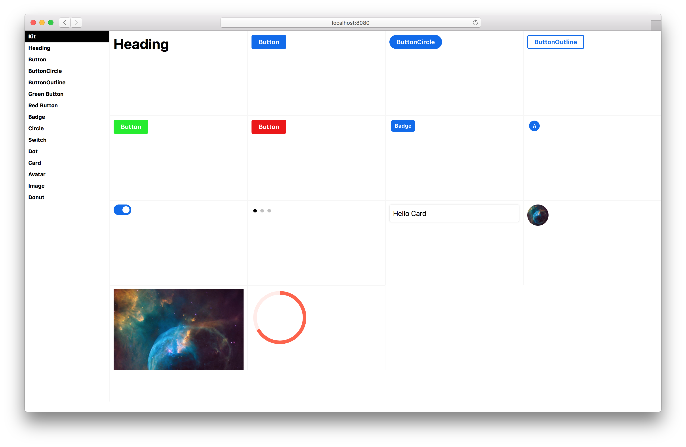

# Library

The Library component manages a list of examples created with the Example component,
showing a grid view by default and a detailed view when a component is clicked.



## Usage

```jsx
import React from 'react'
import { Library, Example } from '@compositor/kit'
import { Button, Heading } from '../src'

const App = props => (
  <Library>
    <Example name='Button'>
      <Button>Beep</Button>
    </Example>
    <Example name='Heading'>
      <Heading>Hello</Heading>
    </Example>
  </Library>
)
```

### Examples array

An array of examples can also be passed as a prop.
Each example object should have a `name` and `element` field for rendering the example.
This can be useful for keeping component examples decoupled from the Kit API
and for the ability to reuse the examples for things like snapshot testing.

```jsx
// examples.js
import React from 'react'
import {
  Button,
  Heading
} from '../src'

const examples = [
  {
    name: 'Button',
    example: (
      <Button>Beep</Button>
    )
  },
  {
    name: 'Heading',
    example: (
      <Heading>Hello</Heading>
    )
  },
]

export default examples
```

```jsx
import React from 'react'
import { Library } from '@compositor/kit'
import examples from './examples'

const App = props => (
  <Library
    title='My Component Library'
    examples={examples}
  />
)
```

```jsx
// example snapshot test file
import TestRenderer from 'react-test-renderer'
import examples from '../examples'

const renderJSON = el => TestRenderer.create(el).toJSON()

examples.forEach(example => {
  test(`${example.name} renders`, () => {
    const json = renderJSON(example.element)
    expect(json).toMatchSnapshot()
  })
})
```

## Library Component

Prop | Type | Description
---|---|---
examples | array | Optional prop to pass examples in as an array of example objects instead of using children
title | string | Optional title to display in the side nav
renderSideNav | function | Optional render prop to customize side nav
renderCard | function | Optional render prop to customize card in the grid view

## Example Component

Use the Example component with the Library component to add examples.
Each Example component requires a unique `name` prop value.

### Usage

```jsx
import React from 'react'
import { Library, Example } from '@compositor/kit'
import Button from '../src/Button'

const App = props => (
  <Library>
    <Example name='Button'>
      <Button>
        Hello
      </Button>
    </Example>
  </Library>
)
```

Prop | Type | Description
---|---|---
name | string (required) | Unique identifier that will be used for navigation in the Library

## Detail Component

Use the Detail component to add additional elements when viewing the example detail view. Elements in the Detail component will not show up in the grid view of the Library.

### Usage

```jsx
import React from 'react'
import { Library, Example, Detail } from '@compositor/kit'

const App = props => (
  <Library>
    <Example name='Button'>
      <Button>Beep</Button>
      <Detail>
        <Button primary>Primary</Button>
        <Button secondary>Secondary</Button>
        <Button large>Large</Button>
        <Button small>Small</Button>
      </Detail>
    </Example>
  </Library>
)
```
